# broadwell

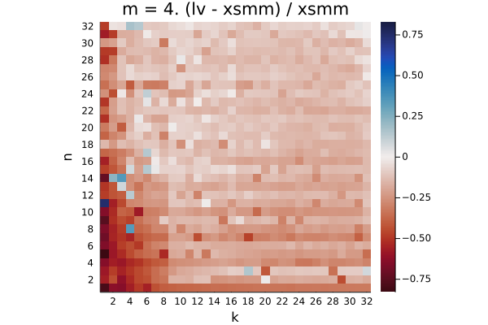

Q₁ = -0.237.  Q₂ = -0.163.  Q₃ = -0.118

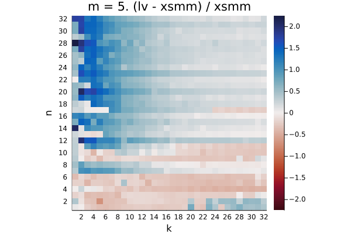

Q₁ = -0.001.  Q₂ = 0.220.  Q₃ = 0.499

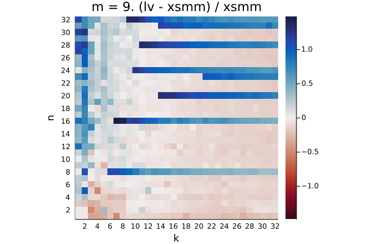

Q₁ = -0.139.  Q₂ = -0.056.  Q₃ = 0.244

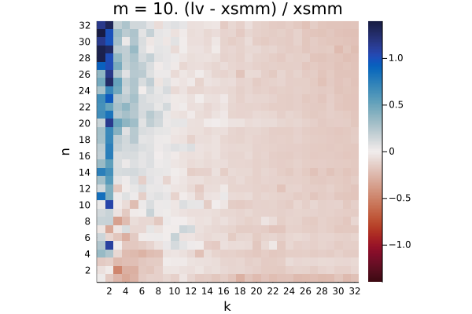

Q₁ = -0.162.  Q₂ = -0.122.  Q₃ = -0.021

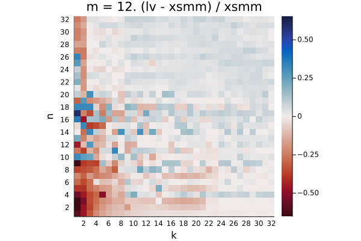

Q₁ = -0.024.  Q₂ = 0.022.  Q₃ = 0.048

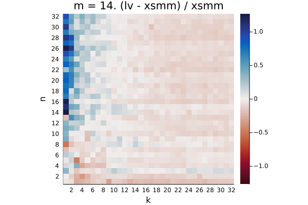

Q₁ = -0.098.  Q₂ = -0.055.  Q₃ = 0.015

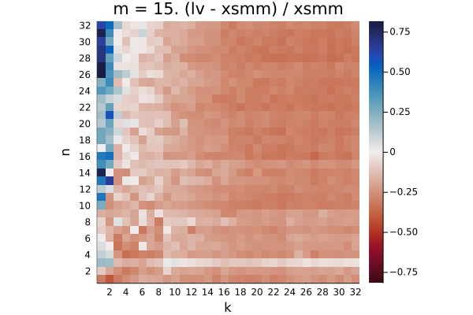

Q₁ = -0.286.  Q₂ = -0.250.  Q₃ = -0.172

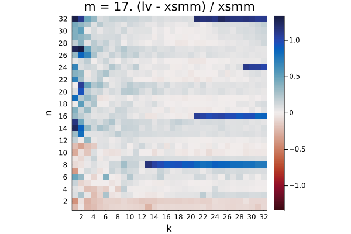

Q₁ = 0.010.  Q₂ = 0.059.  Q₃ = 0.111

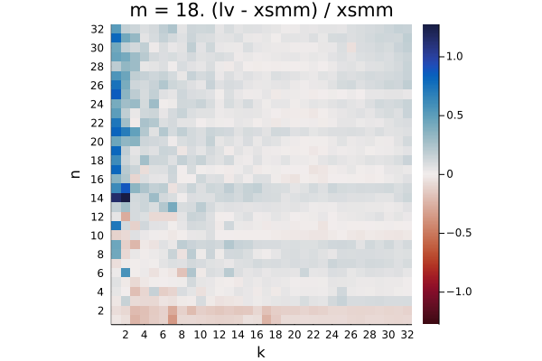

Q₁ = 0.015.  Q₂ = 0.055.  Q₃ = 0.102

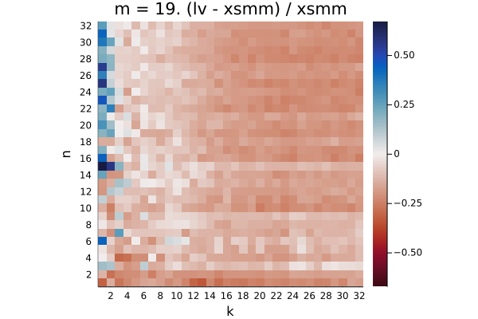

Q₁ = -0.180.  Q₂ = -0.141.  Q₃ = -0.095

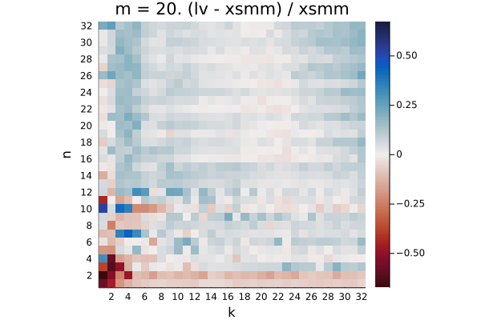

Q₁ = 0.012.  Q₂ = 0.045.  Q₃ = 0.084

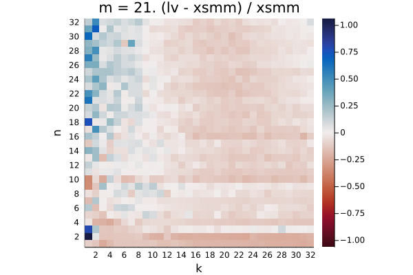

Q₁ = -0.114.  Q₂ = -0.070.  Q₃ = -0.009

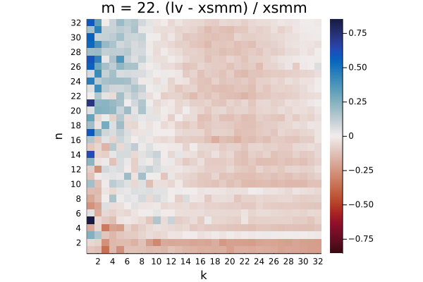

Q₁ = -0.099.  Q₂ = -0.061.  Q₃ = -0.011

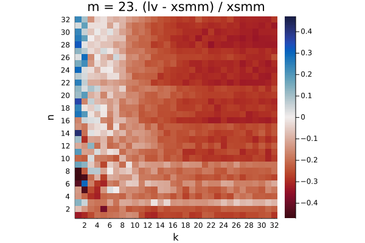

Q₁ = -0.257.  Q₂ = -0.217.  Q₃ = -0.161

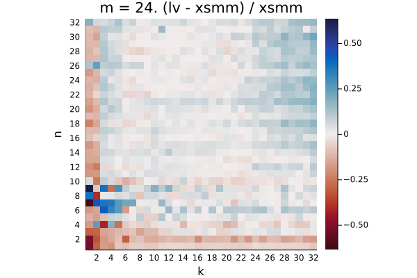

Q₁ = -0.015.  Q₂ = 0.020.  Q₃ = 0.056

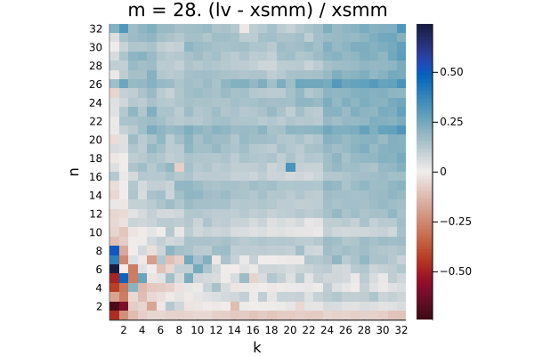

Q₁ = 0.083.  Q₂ = 0.135.  Q₃ = 0.171

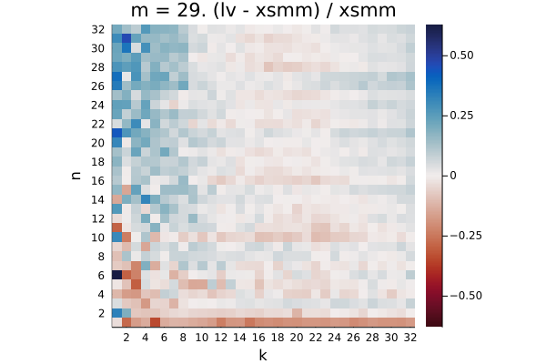

Q₁ = -0.020.  Q₂ = 0.017.  Q₃ = 0.055

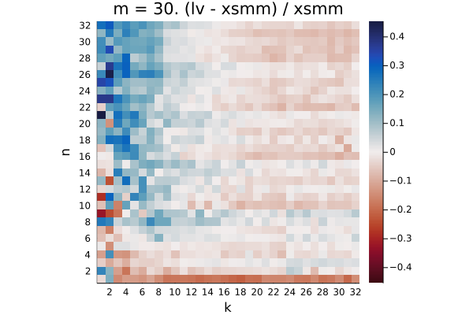

Q₁ = -0.011.  Q₂ = 0.024.  Q₃ = 0.062

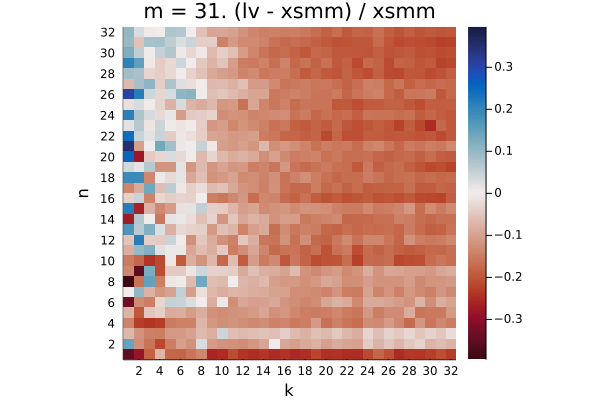

Q₁ = -0.137.  Q₂ = -0.106.  Q₃ = -0.067

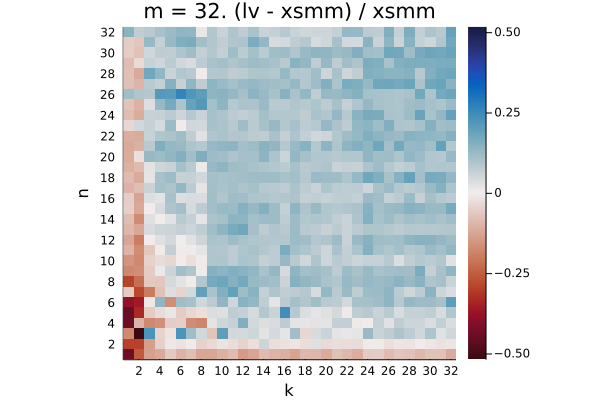

Q₁ = 0.048.  Q₂ = 0.098.  Q₃ = 0.134
