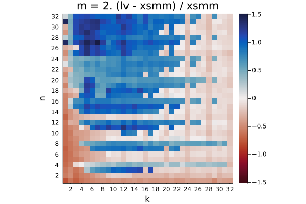
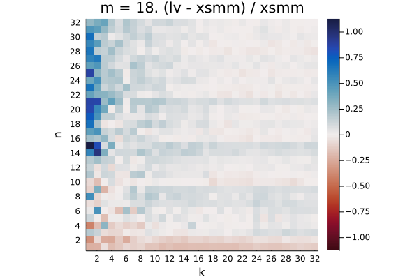
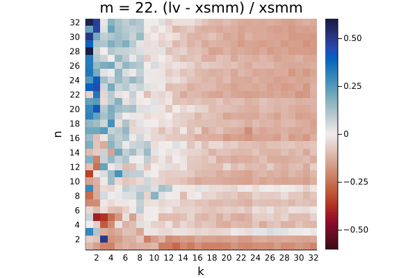
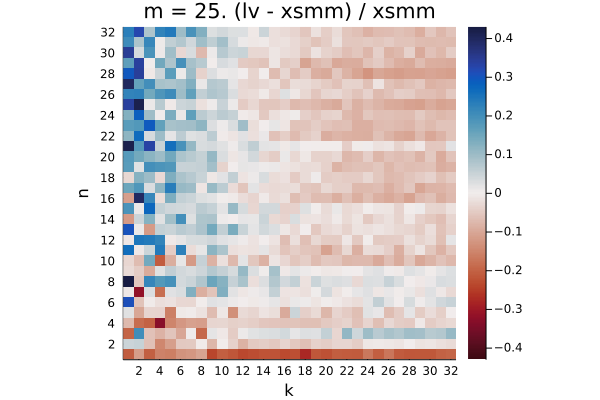

# broadwell

The plots show the relative difference in runtime `(LoopVectorization.jl - libxsmm) / libxsmm` for every `(m, n, k)` triplet. Negative / red values are better for LoopVectorization.jl, positive / blue values are better for libxsmm.

Q₁ = -0.176.  Q₂ = -0.072.  Q₃ = 0.690

Q₁ = -0.152.  Q₂ = 0.154.  Q₃ = 0.835

Q₁ = -0.368.  Q₂ = -0.288.  Q₃ = 0.034

Q₁ = -0.171.  Q₂ = -0.106.  Q₃ = -0.061

Q₁ = 0.001.  Q₂ = 0.214.  Q₃ = 0.460

Q₁ = -0.235.  Q₂ = -0.045.  Q₃ = 0.301

Q₁ = -0.497.  Q₂ = -0.459.  Q₃ = -0.349

Q₁ = -0.135.  Q₂ = -0.093.  Q₃ = -0.056

Q₁ = -0.121.  Q₂ = -0.045.  Q₃ = 0.234

Q₁ = -0.149.  Q₂ = -0.110.  Q₃ = -0.016

Q₁ = -0.351.  Q₂ = -0.307.  Q₃ = -0.219

Q₁ = -0.028.  Q₂ = 0.025.  Q₃ = 0.045

Q₁ = -0.097.  Q₂ = -0.057.  Q₃ = 0.023

Q₁ = -0.096.  Q₂ = -0.060.  Q₃ = 0.014

Q₁ = -0.295.  Q₂ = -0.246.  Q₃ = -0.168

Q₁ = 0.072.  Q₂ = 0.126.  Q₃ = 0.159

Q₁ = -0.002.  Q₂ = 0.050.  Q₃ = 0.109

Q₁ = -0.004.  Q₂ = 0.033.  Q₃ = 0.085

Q₁ = -0.199.  Q₂ = -0.156.  Q₃ = -0.097

Q₁ = -0.004.  Q₂ = 0.028.  Q₃ = 0.067

Q₁ = -0.132.  Q₂ = -0.089.  Q₃ = -0.015

Q₁ = -0.130.  Q₂ = -0.088.  Q₃ = -0.015

Q₁ = -0.282.  Q₂ = -0.232.  Q₃ = -0.153

Q₁ = -0.028.  Q₂ = 0.006.  Q₃ = 0.031

Q₁ = -0.061.  Q₂ = -0.022.  Q₃ = 0.027

Q₁ = -0.061.  Q₂ = -0.021.  Q₃ = 0.027

Q₁ = -0.201.  Q₂ = -0.155.  Q₃ = -0.089

Q₁ = 0.080.  Q₂ = 0.132.  Q₃ = 0.158

Q₁ = -0.046.  Q₂ = -0.012.  Q₃ = 0.037

Q₁ = -0.038.  Q₂ = -0.004.  Q₃ = 0.042

Q₁ = -0.177.  Q₂ = -0.135.  Q₃ = -0.077

Q₁ = 0.054.  Q₂ = 0.094.  Q₃ = 0.122

