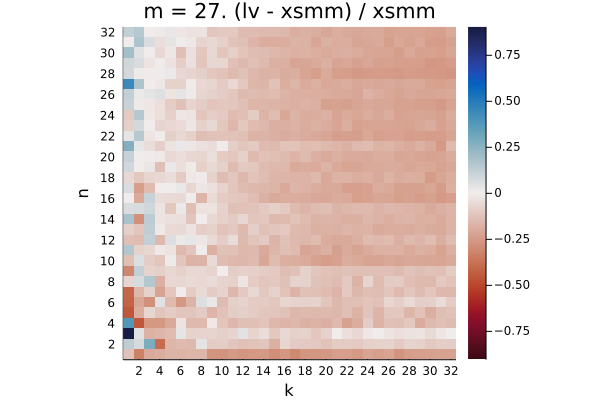
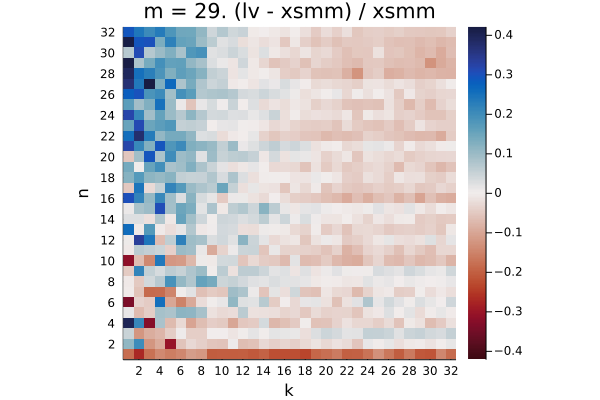

# broadwell

The plots show the relative difference in runtime `(LoopVectorization.jl - libxsmm) / libxsmm` for every `(m, n, k)` triplet. Negative / red values are better for LoopVectorization.jl, positive / blue values are better for libxsmm.

Q₁ = -0.292.  Q₂ = -0.167.  Q₃ = 0.833

Q₁ = -0.263.  Q₂ = 0.156.  Q₃ = 1.048

Q₁ = -0.451.  Q₂ = -0.348.  Q₃ = 0.007

Q₁ = -0.237.  Q₂ = -0.163.  Q₃ = -0.118

Q₁ = -0.009.  Q₂ = 0.216.  Q₃ = 0.501

Q₁ = -0.272.  Q₂ = -0.024.  Q₃ = 0.319

Q₁ = -0.525.  Q₂ = -0.479.  Q₃ = -0.401

Q₁ = -0.177.  Q₂ = -0.119.  Q₃ = -0.073

Q₁ = -0.139.  Q₂ = -0.056.  Q₃ = 0.244

Q₁ = -0.162.  Q₂ = -0.122.  Q₃ = -0.021

Q₁ = -0.361.  Q₂ = -0.328.  Q₃ = -0.229

Q₁ = -0.024.  Q₂ = 0.022.  Q₃ = 0.048

Q₁ = -0.101.  Q₂ = -0.055.  Q₃ = 0.023

Q₁ = -0.098.  Q₂ = -0.055.  Q₃ = 0.015

Q₁ = -0.286.  Q₂ = -0.250.  Q₃ = -0.172

Q₁ = 0.079.  Q₂ = 0.132.  Q₃ = 0.176

Q₁ = 0.010.  Q₂ = 0.059.  Q₃ = 0.111

Q₁ = 0.014.  Q₂ = 0.054.  Q₃ = 0.101

Q₁ = -0.180.  Q₂ = -0.141.  Q₃ = -0.095

Q₁ = 0.012.  Q₂ = 0.045.  Q₃ = 0.084

Q₁ = -0.114.  Q₂ = -0.070.  Q₃ = -0.009

Q₁ = -0.105.  Q₂ = -0.066.  Q₃ = -0.007

Q₁ = -0.257.  Q₂ = -0.217.  Q₃ = -0.161

Q₁ = -0.015.  Q₂ = 0.020.  Q₃ = 0.056

Q₁ = -0.038.  Q₂ = -0.000.  Q₃ = 0.044

Q₁ = -0.033.  Q₂ = 0.001.  Q₃ = 0.043

Q₁ = -0.164.  Q₂ = -0.133.  Q₃ = -0.088

Q₁ = 0.083.  Q₂ = 0.135.  Q₃ = 0.171

Q₁ = -0.020.  Q₂ = 0.017.  Q₃ = 0.055

Q₁ = -0.011.  Q₂ = 0.024.  Q₃ = 0.062

Q₁ = -0.137.  Q₂ = -0.106.  Q₃ = -0.067

Q₁ = 0.048.  Q₂ = 0.098.  Q₃ = 0.134

