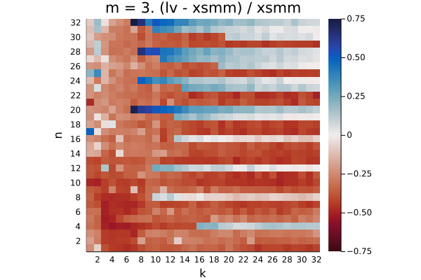
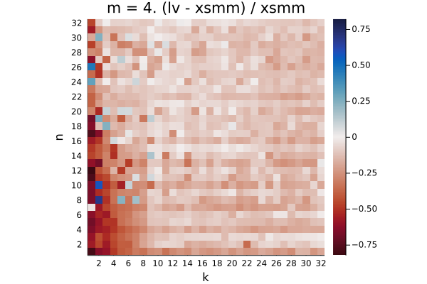
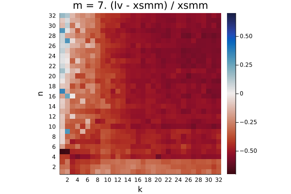
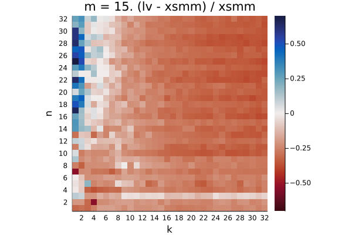
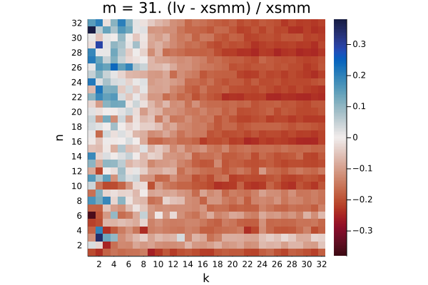

# haswell

The plots show the relative difference in runtime `(LoopVectorization.jl - libxsmm) / libxsmm` for every `(m, n, k)` triplet. Negative / red values are better for LoopVectorization.jl, positive / blue values are better for libxsmm.

Q₁ = -0.282.  Q₂ = -0.140.  Q₃ = 0.866

Q₁ = -0.226.  Q₂ = 0.148.  Q₃ = 1.014

Q₁ = -0.442.  Q₂ = -0.356.  Q₃ = 0.012

Q₁ = -0.224.  Q₂ = -0.139.  Q₃ = -0.074

Q₁ = -0.035.  Q₂ = 0.209.  Q₃ = 0.458

Q₁ = -0.284.  Q₂ = -0.061.  Q₃ = 0.299

Q₁ = -0.512.  Q₂ = -0.462.  Q₃ = -0.388

Q₁ = -0.133.  Q₂ = -0.072.  Q₃ = -0.022

Q₁ = -0.160.  Q₂ = -0.104.  Q₃ = 0.165

Q₁ = -0.174.  Q₂ = -0.145.  Q₃ = -0.073

Q₁ = -0.360.  Q₂ = -0.333.  Q₃ = -0.256

Q₁ = -0.010.  Q₂ = 0.031.  Q₃ = 0.061

Q₁ = -0.093.  Q₂ = -0.050.  Q₃ = 0.018

Q₁ = -0.091.  Q₂ = -0.048.  Q₃ = 0.012

Q₁ = -0.265.  Q₂ = -0.234.  Q₃ = -0.179

Q₁ = 0.093.  Q₂ = 0.150.  Q₃ = 0.185

Q₁ = 0.038.  Q₂ = 0.075.  Q₃ = 0.127

Q₁ = 0.031.  Q₂ = 0.069.  Q₃ = 0.112

Q₁ = -0.140.  Q₂ = -0.104.  Q₃ = -0.067

Q₁ = 0.032.  Q₂ = 0.074.  Q₃ = 0.117

Q₁ = -0.081.  Q₂ = -0.045.  Q₃ = 0.001

Q₁ = -0.079.  Q₂ = -0.039.  Q₃ = 0.001

Q₁ = -0.223.  Q₂ = -0.187.  Q₃ = -0.141

Q₁ = 0.026.  Q₂ = 0.073.  Q₃ = 0.105

Q₁ = 0.000.  Q₂ = 0.036.  Q₃ = 0.077

Q₁ = 0.002.  Q₂ = 0.035.  Q₃ = 0.072

Q₁ = -0.121.  Q₂ = -0.094.  Q₃ = -0.059

Q₁ = 0.095.  Q₂ = 0.162.  Q₃ = 0.200

Q₁ = -0.012.  Q₂ = 0.024.  Q₃ = 0.062

Q₁ = 0.000.  Q₂ = 0.035.  Q₃ = 0.072

Q₁ = -0.115.  Q₂ = -0.086.  Q₃ = -0.048

Q₁ = 0.060.  Q₂ = 0.116.  Q₃ = 0.153

