# haswell

The plots show the relative difference in runtime `(LoopVectorization.jl - libxsmm) / libxsmm` for every `(m, n, k)` triplet. Negative / red values are better for LoopVectorization.jl, positive / blue values are better for libxsmm.

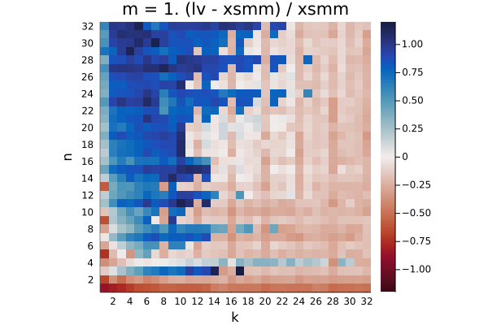

Q₁ = -0.206.  Q₂ = -0.088.  Q₃ = 0.749

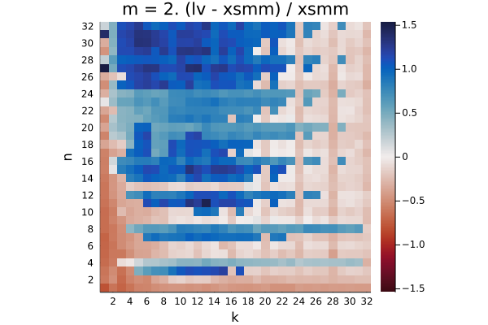

Q₁ = -0.184.  Q₂ = 0.149.  Q₃ = 0.917

Q₁ = -0.405.  Q₂ = -0.322.  Q₃ = 0.003

Q₁ = -0.193.  Q₂ = -0.127.  Q₃ = -0.083

Q₁ = -0.027.  Q₂ = 0.185.  Q₃ = 0.443

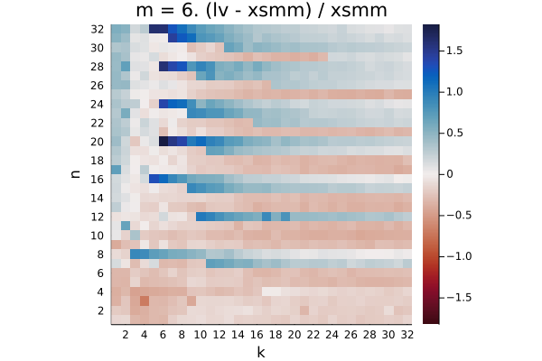

Q₁ = -0.274.  Q₂ = -0.064.  Q₃ = 0.265

Q₁ = -0.531.  Q₂ = -0.487.  Q₃ = -0.368

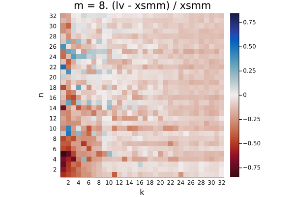

Q₁ = -0.144.  Q₂ = -0.097.  Q₃ = -0.052

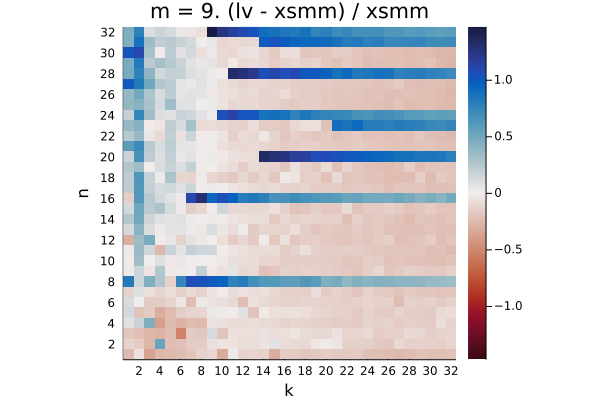

Q₁ = -0.174.  Q₂ = -0.100.  Q₃ = 0.174

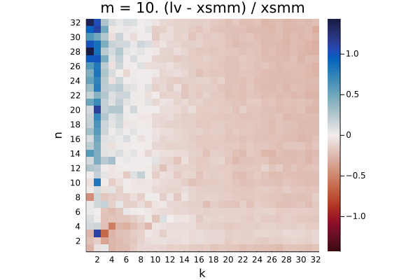

Q₁ = -0.204.  Q₂ = -0.151.  Q₃ = -0.067

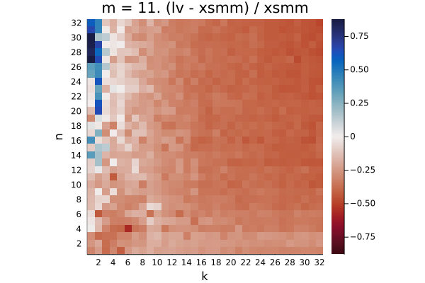

Q₁ = -0.396.  Q₂ = -0.339.  Q₃ = -0.247

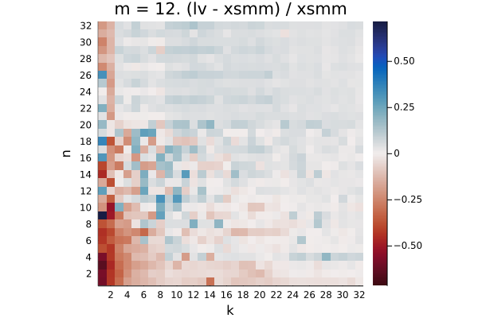

Q₁ = -0.016.  Q₂ = 0.032.  Q₃ = 0.052

Q₁ = -0.128.  Q₂ = -0.088.  Q₃ = 0.009

Q₁ = -0.130.  Q₂ = -0.086.  Q₃ = -0.005

Q₁ = -0.317.  Q₂ = -0.268.  Q₃ = -0.189

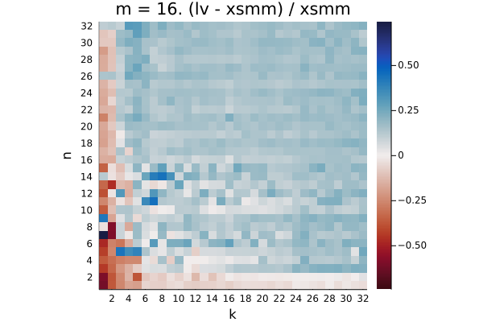

Q₁ = 0.094.  Q₂ = 0.143.  Q₃ = 0.169

Q₁ = 0.003.  Q₂ = 0.044.  Q₃ = 0.112

Q₁ = 0.005.  Q₂ = 0.042.  Q₃ = 0.085

Q₁ = -0.193.  Q₂ = -0.150.  Q₃ = -0.095

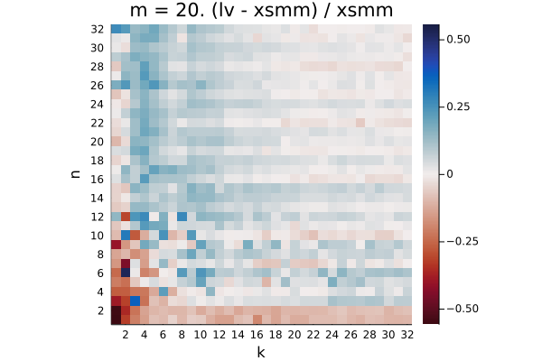

Q₁ = -0.005.  Q₂ = 0.032.  Q₃ = 0.075

Q₁ = -0.147.  Q₂ = -0.101.  Q₃ = -0.021

Q₁ = -0.146.  Q₂ = -0.101.  Q₃ = -0.025

Q₁ = -0.295.  Q₂ = -0.245.  Q₃ = -0.158

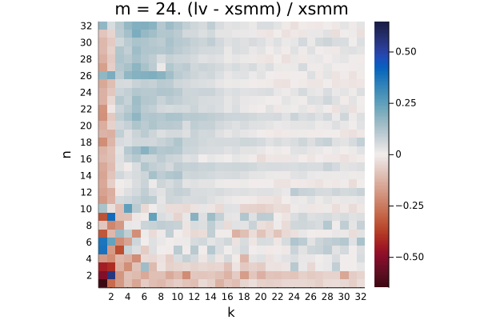

Q₁ = -0.010.  Q₂ = 0.028.  Q₃ = 0.064

Q₁ = -0.061.  Q₂ = -0.019.  Q₃ = 0.039

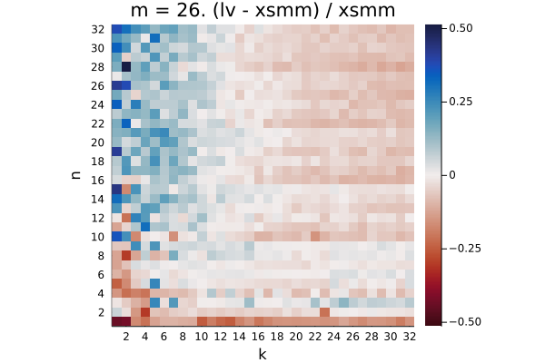

Q₁ = -0.059.  Q₂ = -0.018.  Q₃ = 0.035

Q₁ = -0.200.  Q₂ = -0.154.  Q₃ = -0.089

Q₁ = 0.081.  Q₂ = 0.142.  Q₃ = 0.177

Q₁ = -0.067.  Q₂ = -0.032.  Q₃ = 0.024

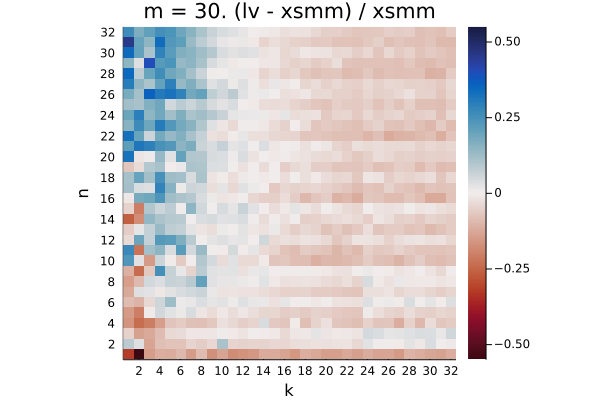

Q₁ = -0.063.  Q₂ = -0.027.  Q₃ = 0.022

Q₁ = -0.195.  Q₂ = -0.155.  Q₃ = -0.085

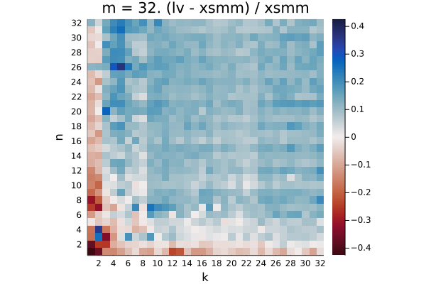

Q₁ = 0.065.  Q₂ = 0.103.  Q₃ = 0.128

