# skylake-avx512

Q₁ = -0.111.  Q₂ = -0.039.  Q₃ = 0.075

Q₁ = -0.144.  Q₂ = -0.017.  Q₃ = 0.082

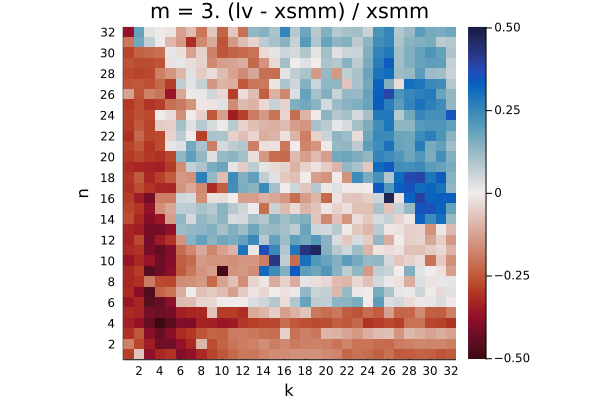

Q₁ = -0.197.  Q₂ = -0.036.  Q₃ = 0.117

Q₁ = -0.179.  Q₂ = -0.098.  Q₃ = 0.080

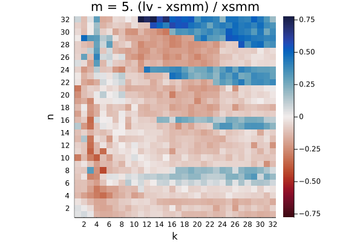

Q₁ = -0.129.  Q₂ = -0.043.  Q₃ = 0.118

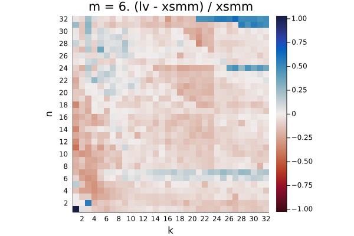

Q₁ = -0.106.  Q₂ = -0.039.  Q₃ = 0.086

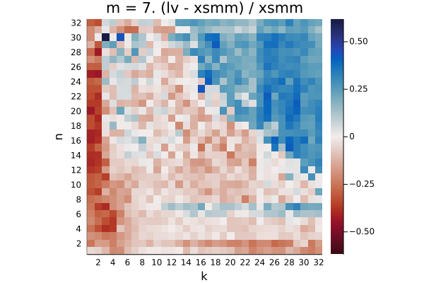

Q₁ = -0.100.  Q₂ = -0.026.  Q₃ = 0.175

Q₁ = -0.076.  Q₂ = -0.010.  Q₃ = 0.169

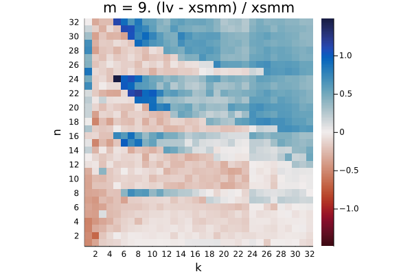

Q₁ = -0.142.  Q₂ = 0.017.  Q₃ = 0.450

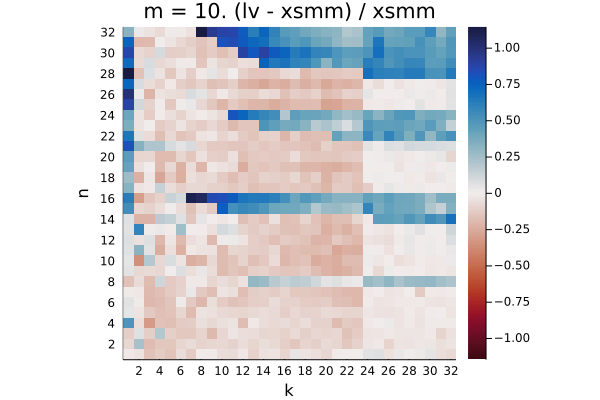

Q₁ = -0.120.  Q₂ = -0.015.  Q₃ = 0.205

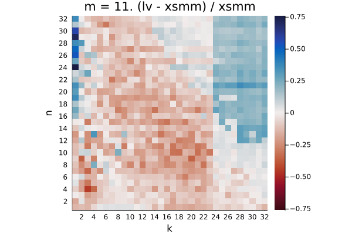

Q₁ = -0.138.  Q₂ = -0.056.  Q₃ = 0.055

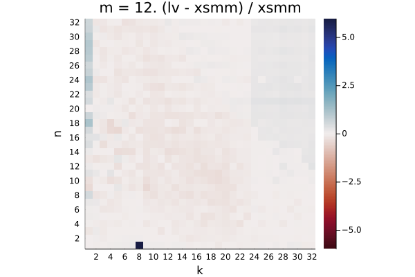

Q₁ = -0.134.  Q₂ = -0.037.  Q₃ = 0.061

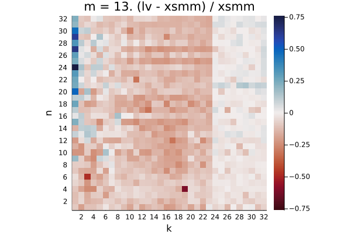

Q₁ = -0.126.  Q₂ = -0.049.  Q₃ = 0.050

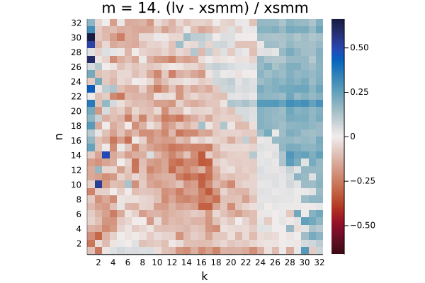

Q₁ = -0.123.  Q₂ = -0.055.  Q₃ = 0.051

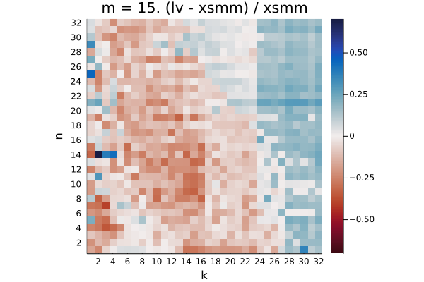

Q₁ = -0.125.  Q₂ = -0.047.  Q₃ = 0.083

Q₁ = -0.107.  Q₂ = -0.037.  Q₃ = 0.092

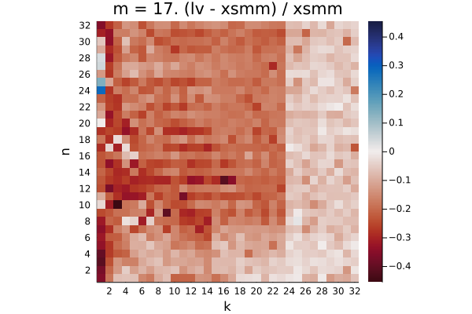

Q₁ = -0.190.  Q₂ = -0.087.  Q₃ = 0.028

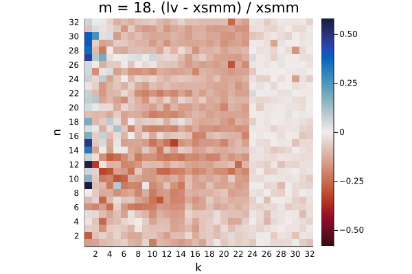

Q₁ = -0.123.  Q₂ = -0.048.  Q₃ = 0.094

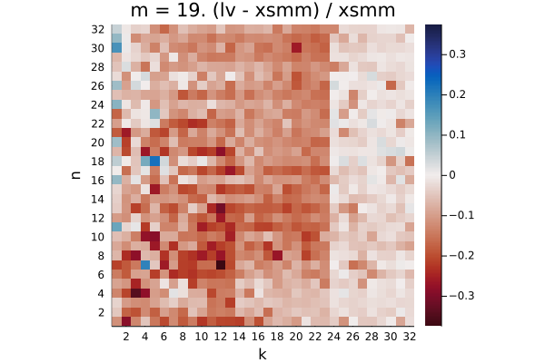

Q₁ = -0.120.  Q₂ = -0.050.  Q₃ = 0.063

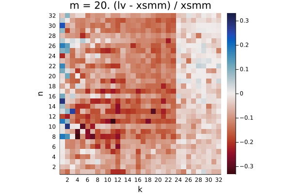

Q₁ = -0.116.  Q₂ = -0.044.  Q₃ = 0.075

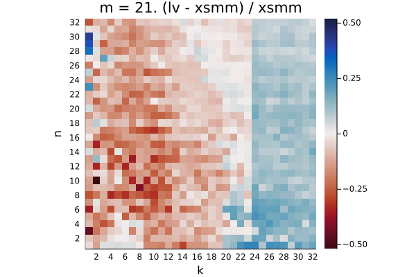

Q₁ = -0.125.  Q₂ = -0.047.  Q₃ = 0.081

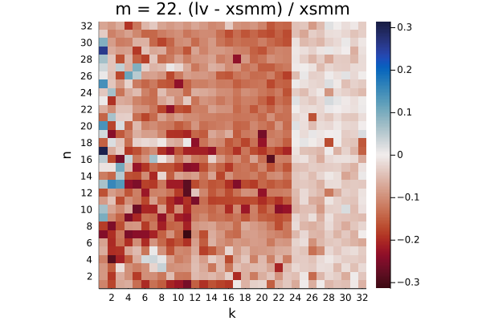

Q₁ = -0.108.  Q₂ = -0.029.  Q₃ = 0.090

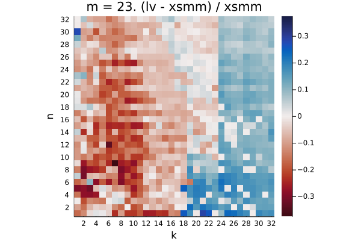

Q₁ = -0.100.  Q₂ = -0.030.  Q₃ = 0.078

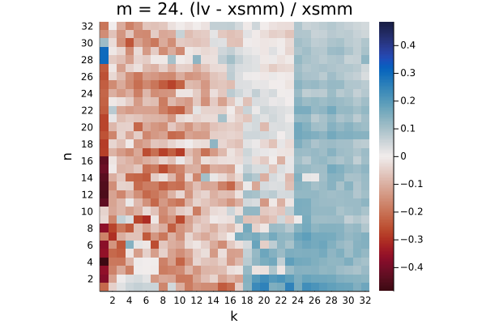

Q₁ = -0.099.  Q₂ = -0.013.  Q₃ = 0.099

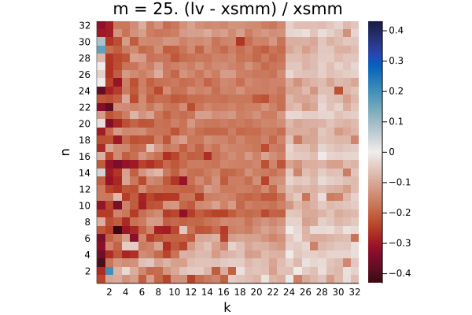

Q₁ = -0.160.  Q₂ = -0.070.  Q₃ = 0.028

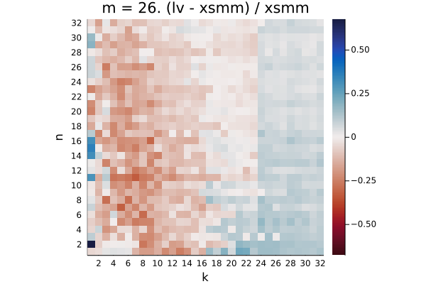

Q₁ = -0.101.  Q₂ = -0.021.  Q₃ = 0.055

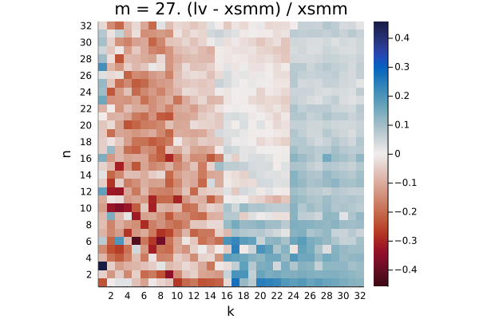

Q₁ = -0.097.  Q₂ = -0.012.  Q₃ = 0.062

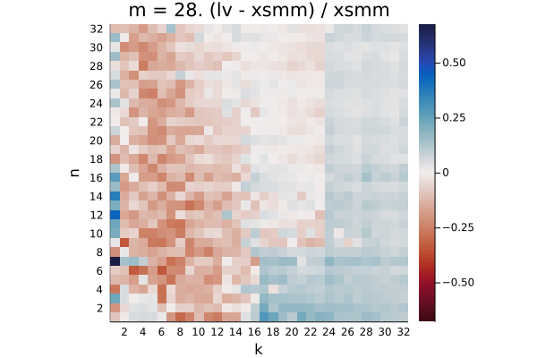

Q₁ = -0.094.  Q₂ = -0.004.  Q₃ = 0.061

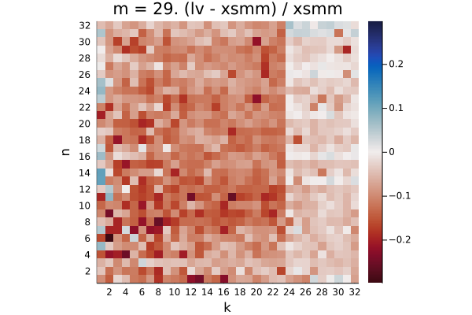

Q₁ = -0.096.  Q₂ = -0.012.  Q₃ = 0.056

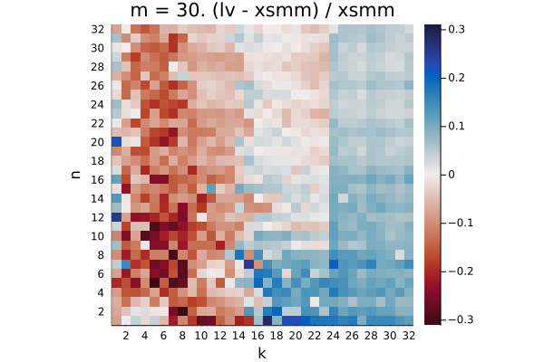

Q₁ = -0.084.  Q₂ = -0.007.  Q₃ = 0.060

Q₁ = -0.096.  Q₂ = -0.007.  Q₃ = 0.054

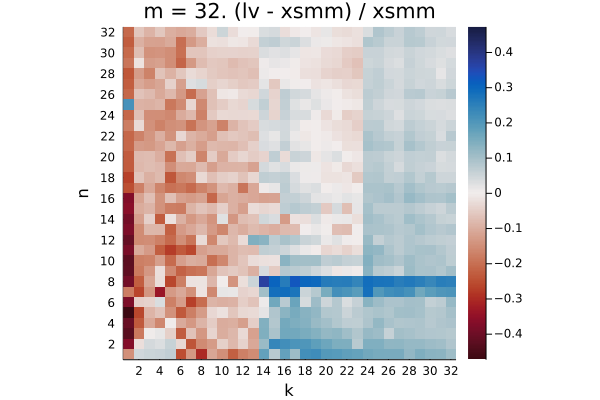

Q₁ = -0.084.  Q₂ = 0.003.  Q₃ = 0.070
