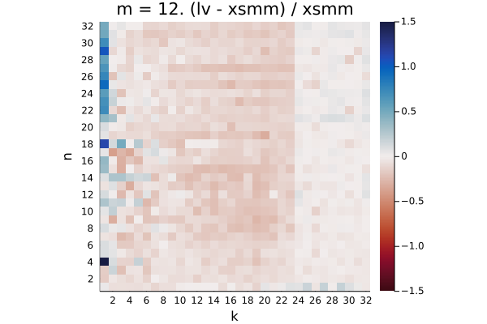
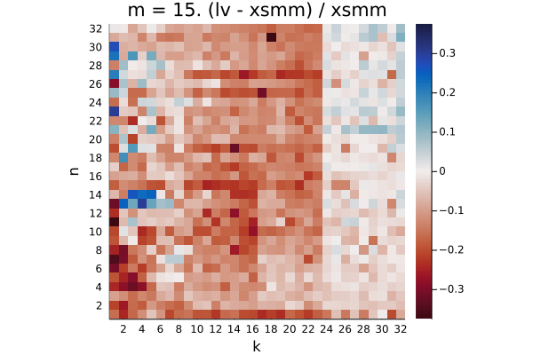
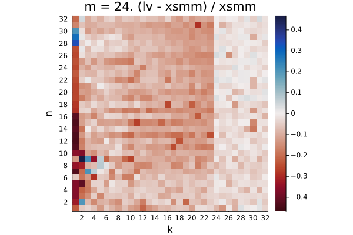
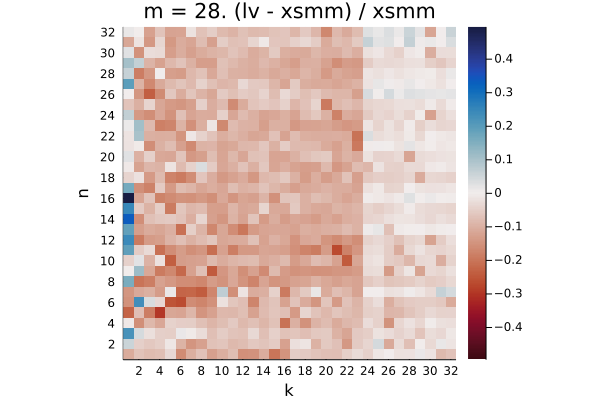

# skylake-avx512

The plots show the relative difference in runtime `(LoopVectorization.jl - libxsmm) / libxsmm` for every `(m, n, k)` triplet. Negative / red values are better for LoopVectorization.jl, positive / blue values are better for libxsmm.

Q₁ = -0.181.  Q₂ = -0.075.  Q₃ = 0.078

Q₁ = -0.149.  Q₂ = -0.077.  Q₃ = -0.004

Q₁ = -0.174.  Q₂ = -0.041.  Q₃ = 0.049

Q₁ = -0.167.  Q₂ = -0.114.  Q₃ = -0.040

Q₁ = -0.142.  Q₂ = -0.080.  Q₃ = 0.039

Q₁ = -0.124.  Q₂ = -0.069.  Q₃ = -0.021

Q₁ = -0.096.  Q₂ = -0.041.  Q₃ = 0.022

Q₁ = -0.080.  Q₂ = -0.041.  Q₃ = 0.014

Q₁ = -0.164.  Q₂ = -0.026.  Q₃ = 0.448

Q₁ = -0.129.  Q₂ = -0.040.  Q₃ = 0.110

Q₁ = -0.155.  Q₂ = -0.090.  Q₃ = -0.013

Q₁ = -0.143.  Q₂ = -0.083.  Q₃ = -0.012

Q₁ = -0.142.  Q₂ = -0.090.  Q₃ = -0.021

Q₁ = -0.143.  Q₂ = -0.090.  Q₃ = -0.023

Q₁ = -0.143.  Q₂ = -0.089.  Q₃ = -0.027

Q₁ = -0.137.  Q₂ = -0.077.  Q₃ = -0.030

Q₁ = -0.208.  Q₂ = -0.162.  Q₃ = -0.076

Q₁ = -0.143.  Q₂ = -0.092.  Q₃ = -0.033

Q₁ = -0.143.  Q₂ = -0.094.  Q₃ = -0.036

Q₁ = -0.136.  Q₂ = -0.090.  Q₃ = -0.036

Q₁ = -0.142.  Q₂ = -0.093.  Q₃ = -0.035

Q₁ = -0.138.  Q₂ = -0.095.  Q₃ = -0.042

Q₁ = -0.138.  Q₂ = -0.094.  Q₃ = -0.038

Q₁ = -0.123.  Q₂ = -0.082.  Q₃ = -0.039

Q₁ = -0.182.  Q₂ = -0.147.  Q₃ = -0.082

Q₁ = -0.125.  Q₂ = -0.087.  Q₃ = -0.041

Q₁ = -0.130.  Q₂ = -0.088.  Q₃ = -0.044

Q₁ = -0.118.  Q₂ = -0.083.  Q₃ = -0.038

Q₁ = -0.123.  Q₂ = -0.088.  Q₃ = -0.044

Q₁ = -0.123.  Q₂ = -0.089.  Q₃ = -0.042

Q₁ = -0.122.  Q₂ = -0.087.  Q₃ = -0.045

Q₁ = -0.111.  Q₂ = -0.074.  Q₃ = -0.033

