# znver2

The plots show the relative difference in runtime `(LoopVectorization.jl - libxsmm) / libxsmm` for every `(m, n, k)` triplet. Negative / red values are better for LoopVectorization.jl, positive / blue values are better for libxsmm.

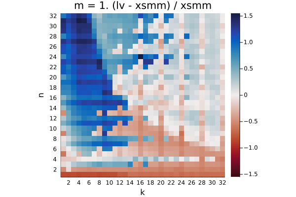

Q₁ = -0.391.  Q₂ = -0.297.  Q₃ = 0.789

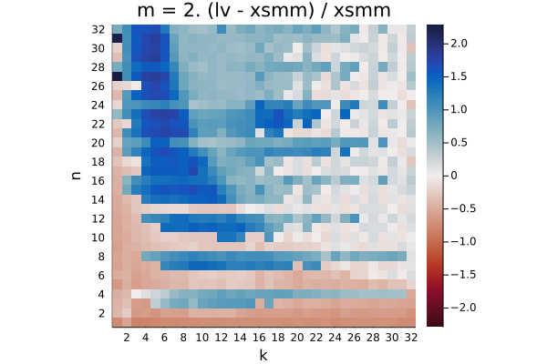

Q₁ = -0.346.  Q₂ = 0.471.  Q₃ = 1.233

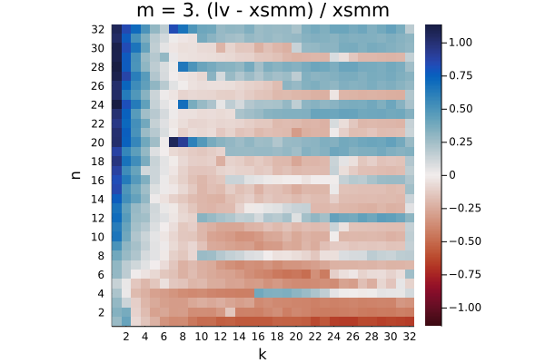

Q₁ = -0.378.  Q₂ = -0.120.  Q₃ = 0.075

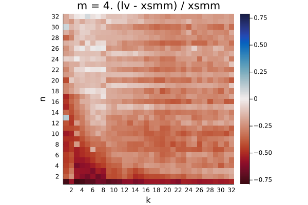

Q₁ = -0.331.  Q₂ = -0.263.  Q₃ = -0.198

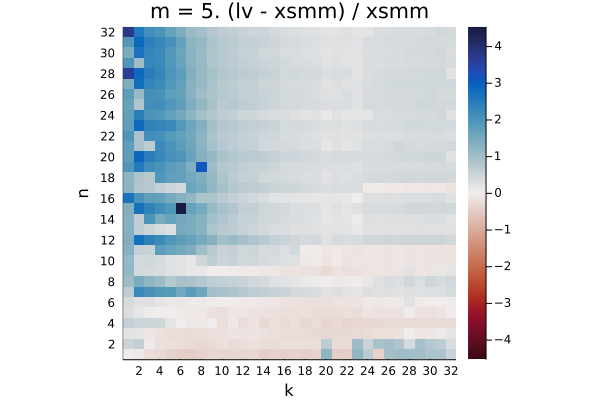

Q₁ = 0.136.  Q₂ = 0.327.  Q₃ = 0.853

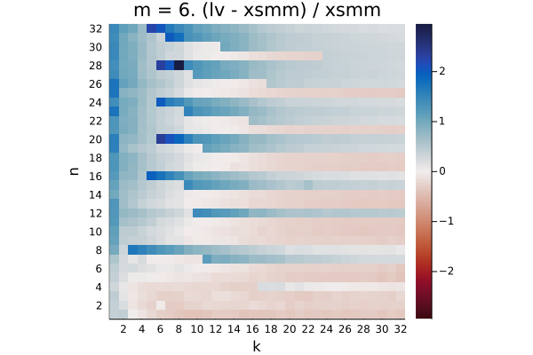

Q₁ = -0.208.  Q₂ = 0.260.  Q₃ = 0.525

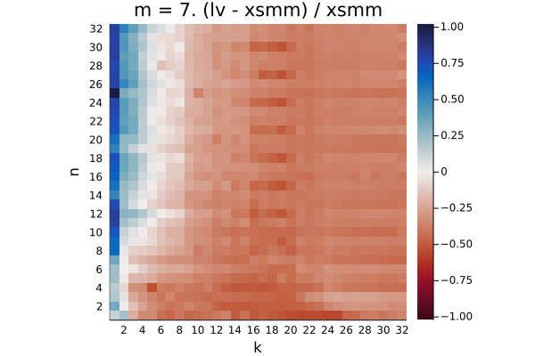

Q₁ = -0.506.  Q₂ = -0.444.  Q₃ = -0.265

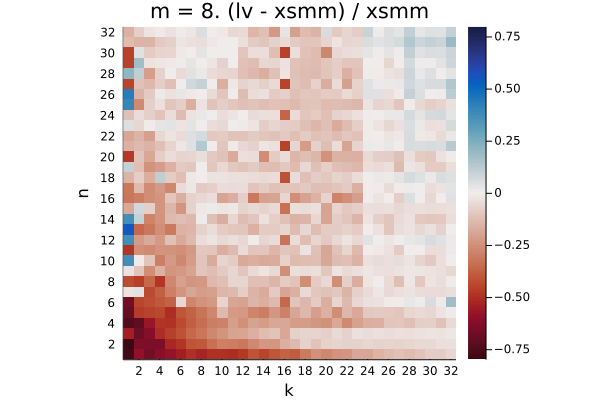

Q₁ = -0.277.  Q₂ = -0.236.  Q₃ = -0.172

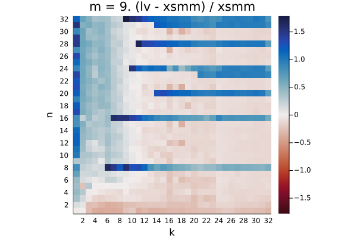

Q₁ = -0.146.  Q₂ = -0.034.  Q₃ = 0.443

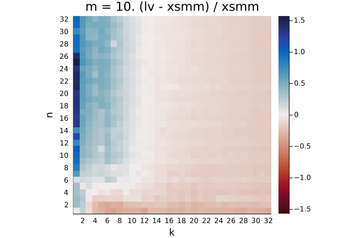

Q₁ = -0.157.  Q₂ = -0.094.  Q₃ = 0.099

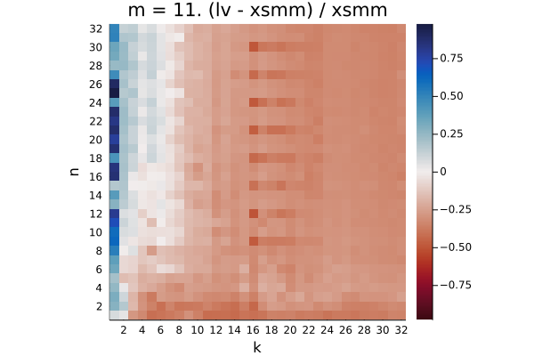

Q₁ = -0.389.  Q₂ = -0.336.  Q₃ = -0.183

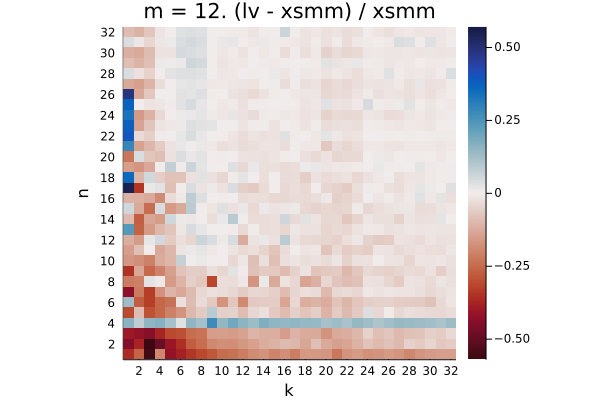

Q₁ = -0.057.  Q₂ = -0.021.  Q₃ = -0.003

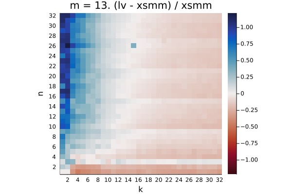

Q₁ = -0.125.  Q₂ = -0.047.  Q₃ = 0.109

Q₁ = -0.123.  Q₂ = -0.045.  Q₃ = 0.112

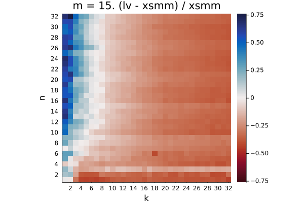

Q₁ = -0.334.  Q₂ = -0.257.  Q₃ = -0.110

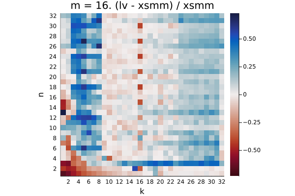

Q₁ = 0.005.  Q₂ = 0.046.  Q₃ = 0.086

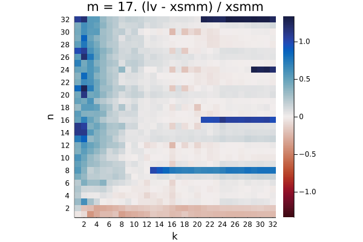

Q₁ = -0.033.  Q₂ = 0.066.  Q₃ = 0.187

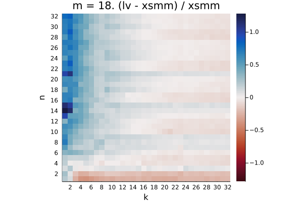

Q₁ = -0.038.  Q₂ = 0.045.  Q₃ = 0.153

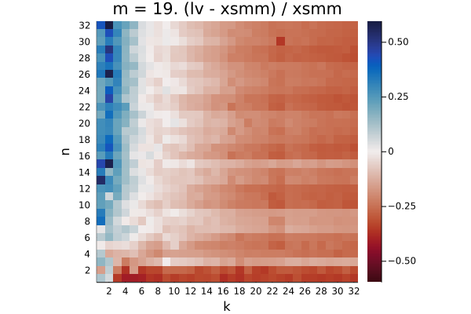

Q₁ = -0.248.  Q₂ = -0.166.  Q₃ = -0.054

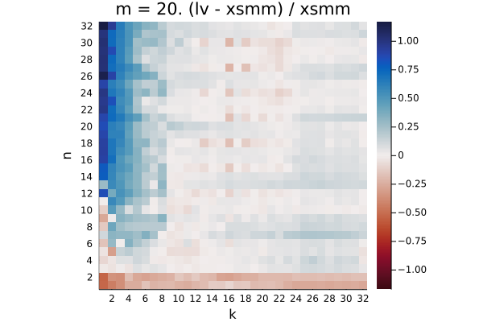

Q₁ = -0.042.  Q₂ = 0.023.  Q₃ = 0.132

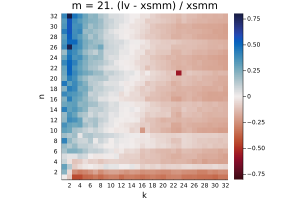

Q₁ = -0.152.  Q₂ = -0.073.  Q₃ = 0.060

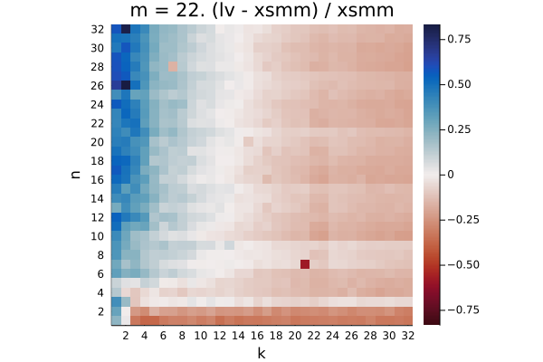

Q₁ = -0.153.  Q₂ = -0.074.  Q₃ = 0.067

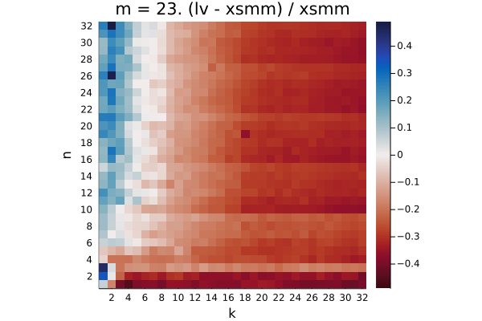

Q₁ = -0.313.  Q₂ = -0.248.  Q₃ = -0.123

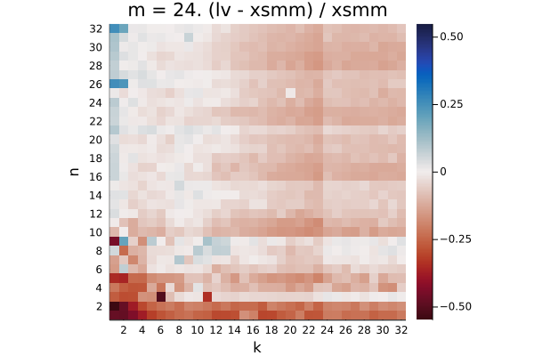

Q₁ = -0.111.  Q₂ = -0.069.  Q₃ = -0.020

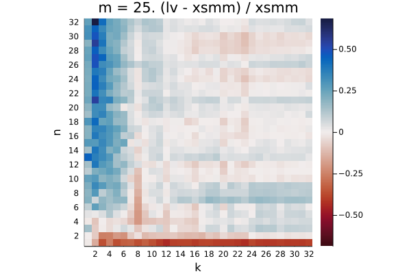

Q₁ = -0.093.  Q₂ = -0.026.  Q₃ = 0.083

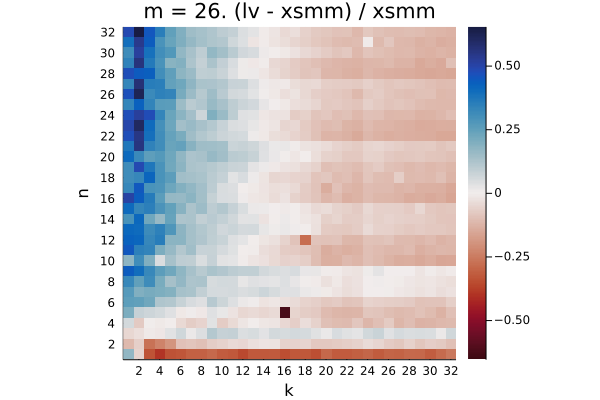

Q₁ = -0.095.  Q₂ = -0.026.  Q₃ = 0.085

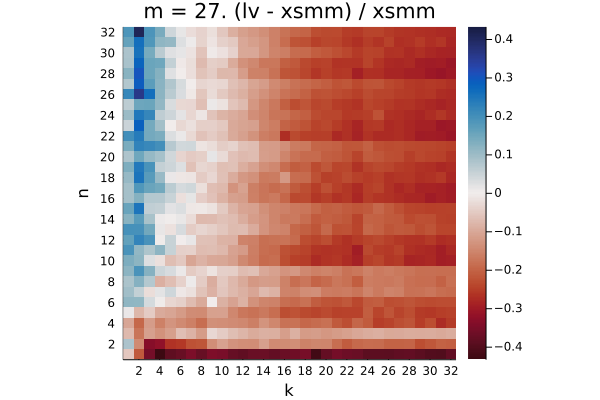

Q₁ = -0.246.  Q₂ = -0.177.  Q₃ = -0.065

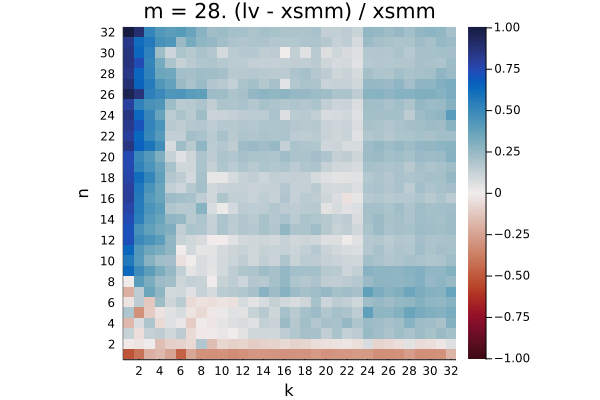

Q₁ = 0.109.  Q₂ = 0.162.  Q₃ = 0.239

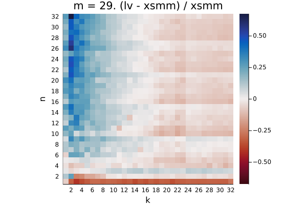

Q₁ = -0.063.  Q₂ = -0.010.  Q₃ = 0.093

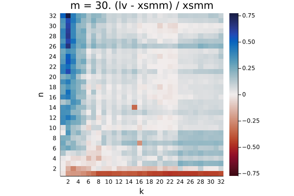

Q₁ = -0.062.  Q₂ = -0.010.  Q₃ = 0.092

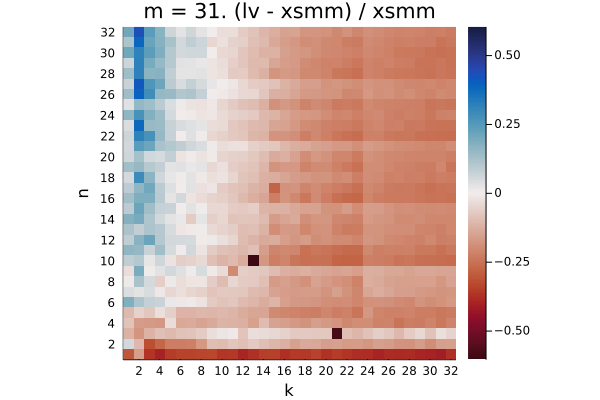

Q₁ = -0.213.  Q₂ = -0.158.  Q₃ = -0.044

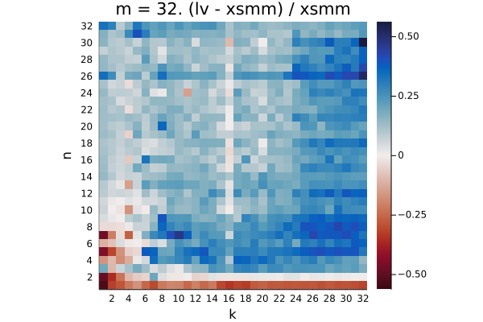

Q₁ = 0.015.  Q₂ = 0.057.  Q₃ = 0.092

