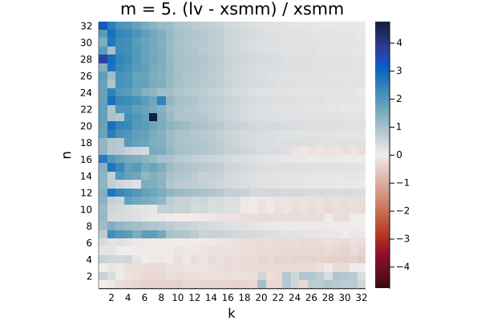
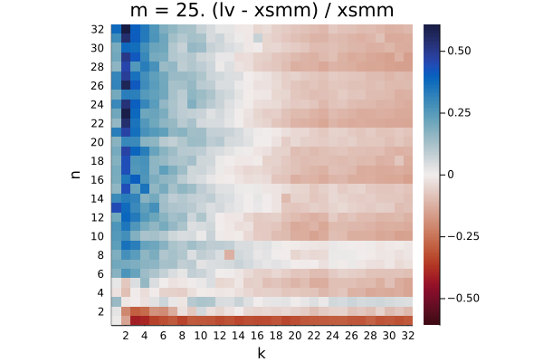
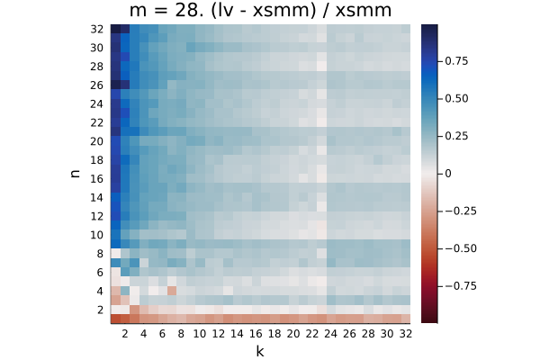

# znver2

Q₁ = -0.161.  Q₂ = 0.167.  Q₃ = 0.690

Q₁ = -0.125.  Q₂ = 0.454.  Q₃ = 0.915

Q₁ = -0.202.  Q₂ = -0.047.  Q₃ = 0.292

Q₁ = -0.243.  Q₂ = -0.065.  Q₃ = 0.010

Q₁ = 0.193.  Q₂ = 0.383.  Q₃ = 0.717

Q₁ = -0.135.  Q₂ = 0.271.  Q₃ = 0.498

Q₁ = -0.403.  Q₂ = -0.362.  Q₃ = -0.239

Q₁ = -0.159.  Q₂ = -0.094.  Q₃ = -0.050

Q₁ = -0.126.  Q₂ = -0.073.  Q₃ = 0.426

Q₁ = -0.134.  Q₂ = -0.103.  Q₃ = 0.033

Q₁ = -0.328.  Q₂ = -0.295.  Q₃ = -0.196

Q₁ = -0.072.  Q₂ = -0.033.  Q₃ = -0.004

Q₁ = -0.075.  Q₂ = -0.037.  Q₃ = 0.089

Q₁ = -0.072.  Q₂ = -0.036.  Q₃ = 0.070

Q₁ = -0.249.  Q₂ = -0.195.  Q₃ = -0.111

Q₁ = -0.015.  Q₂ = 0.036.  Q₃ = 0.097

Q₁ = -0.002.  Q₂ = 0.052.  Q₃ = 0.160

Q₁ = -0.002.  Q₂ = 0.039.  Q₃ = 0.117

Q₁ = -0.168.  Q₂ = -0.112.  Q₃ = -0.051

Q₁ = 0.002.  Q₂ = 0.047.  Q₃ = 0.107

Q₁ = -0.075.  Q₂ = -0.026.  Q₃ = 0.034

Q₁ = -0.069.  Q₂ = -0.022.  Q₃ = 0.030

Q₁ = -0.196.  Q₂ = -0.155.  Q₃ = -0.090

Q₁ = -0.038.  Q₂ = 0.065.  Q₃ = 0.165

Q₁ = -0.017.  Q₂ = 0.025.  Q₃ = 0.080

Q₁ = -0.017.  Q₂ = 0.025.  Q₃ = 0.080

Q₁ = -0.127.  Q₂ = -0.086.  Q₃ = -0.018

Q₁ = 0.122.  Q₂ = 0.187.  Q₃ = 0.232

Q₁ = 0.025.  Q₂ = 0.065.  Q₃ = 0.131

Q₁ = 0.022.  Q₂ = 0.064.  Q₃ = 0.126

Q₁ = -0.095.  Q₂ = -0.044.  Q₃ = 0.021

Q₁ = 0.098.  Q₂ = 0.163.  Q₃ = 0.251

