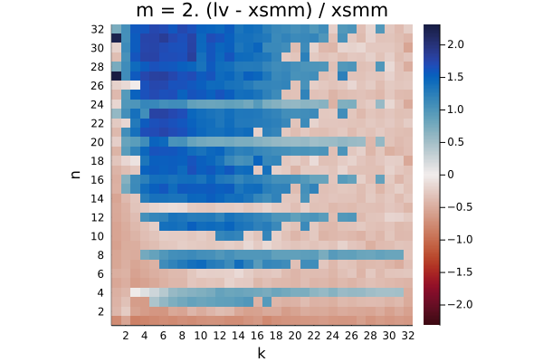
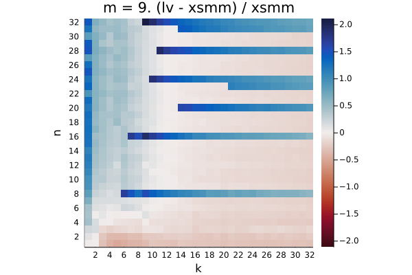
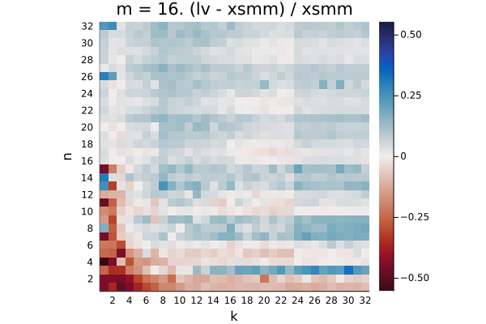
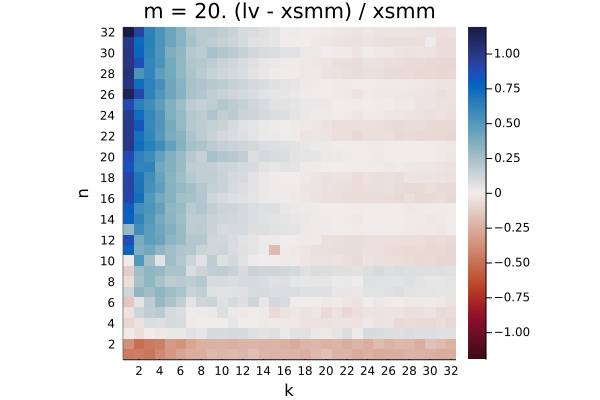
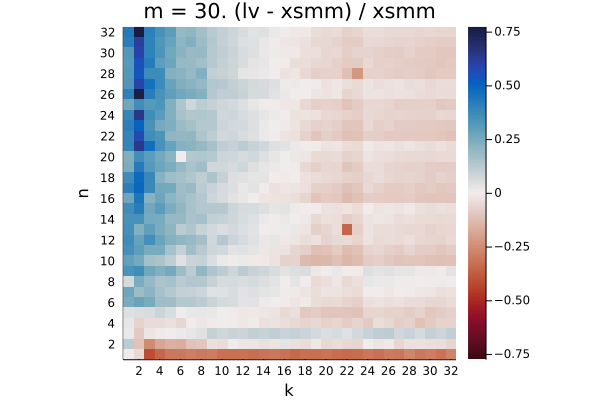
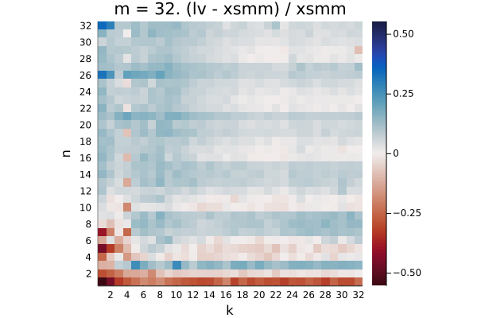

# znver2

The plots show the relative difference in runtime `(LoopVectorization.jl - libxsmm) / libxsmm` for every `(m, n, k)` triplet. Negative / red values are better for LoopVectorization.jl, positive / blue values are better for libxsmm.

Q₁ = -0.391.  Q₂ = -0.297.  Q₃ = 0.789

Q₁ = -0.346.  Q₂ = 0.471.  Q₃ = 1.233

Q₁ = -0.378.  Q₂ = -0.120.  Q₃ = 0.075

Q₁ = -0.331.  Q₂ = -0.263.  Q₃ = -0.198

Q₁ = 0.136.  Q₂ = 0.327.  Q₃ = 0.853

Q₁ = -0.208.  Q₂ = 0.260.  Q₃ = 0.525

Q₁ = -0.506.  Q₂ = -0.444.  Q₃ = -0.265

Q₁ = -0.277.  Q₂ = -0.236.  Q₃ = -0.172

Q₁ = -0.146.  Q₂ = -0.034.  Q₃ = 0.443

Q₁ = -0.157.  Q₂ = -0.094.  Q₃ = 0.099

Q₁ = -0.389.  Q₂ = -0.336.  Q₃ = -0.183

Q₁ = -0.057.  Q₂ = -0.021.  Q₃ = -0.003

Q₁ = -0.125.  Q₂ = -0.047.  Q₃ = 0.109

Q₁ = -0.123.  Q₂ = -0.045.  Q₃ = 0.112

Q₁ = -0.334.  Q₂ = -0.257.  Q₃ = -0.110

Q₁ = 0.005.  Q₂ = 0.046.  Q₃ = 0.086

Q₁ = -0.033.  Q₂ = 0.066.  Q₃ = 0.187

Q₁ = -0.038.  Q₂ = 0.045.  Q₃ = 0.153

Q₁ = -0.248.  Q₂ = -0.166.  Q₃ = -0.054

Q₁ = -0.042.  Q₂ = 0.023.  Q₃ = 0.132

Q₁ = -0.152.  Q₂ = -0.073.  Q₃ = 0.060

Q₁ = -0.153.  Q₂ = -0.074.  Q₃ = 0.067

Q₁ = -0.313.  Q₂ = -0.248.  Q₃ = -0.123

Q₁ = -0.111.  Q₂ = -0.069.  Q₃ = -0.020

Q₁ = -0.093.  Q₂ = -0.026.  Q₃ = 0.083

Q₁ = -0.095.  Q₂ = -0.026.  Q₃ = 0.085

Q₁ = -0.246.  Q₂ = -0.177.  Q₃ = -0.065

Q₁ = 0.109.  Q₂ = 0.162.  Q₃ = 0.239

Q₁ = -0.063.  Q₂ = -0.010.  Q₃ = 0.093

Q₁ = -0.062.  Q₂ = -0.010.  Q₃ = 0.092

Q₁ = -0.213.  Q₂ = -0.158.  Q₃ = -0.044

Q₁ = 0.015.  Q₂ = 0.057.  Q₃ = 0.092

