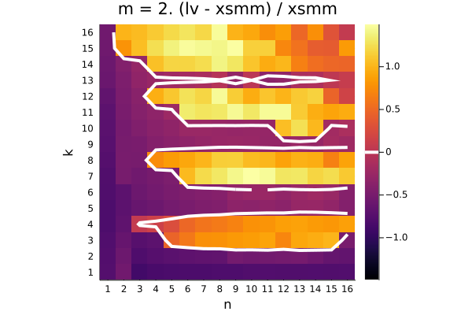
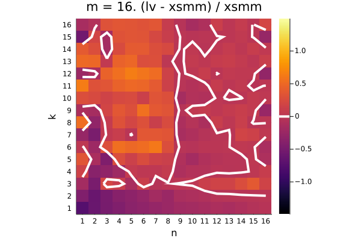

Instructions:

```console
git clone --recursive https://github.com/haampie/smm-bench.git
cd smm-bench

# Use AVX={1,2,3} for AVX, AVX2, AVX-512 resp
# benchmarks in the readme are done on zen2 using AVX=2
make AVX=2 -j
```

color scale is (lv - xsmm) / xsmm






