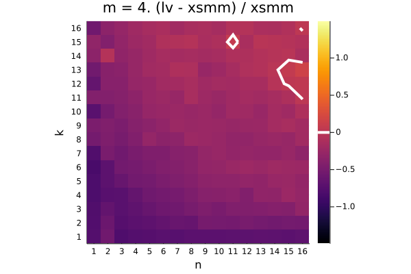

Instructions:

```console
git clone --recursive https://github.com/haampie/smm-bench.git
cd smm-bench

# Use AVX={1,2,3} for AVX, AVX2, AVX-512 resp
make AVX=1 -j
```

color scale is (lv - xsmm) / xsmm





