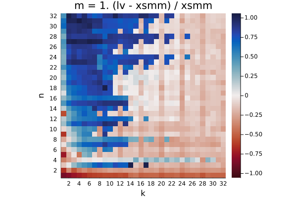

Instructions:

```console
git clone --recursive https://github.com/haampie/smm-bench.git
cd smm-bench
```

## zen2 (gcc 9.3)

```
make AVX=2 INTRINSICS=1 STATIC=0 -j
julia --project=. -O3
julia> using Pkg; pkg"instantiate"
julia> ms = (1, 2, 4, 8, 16); ns=1:16; ks=1:16
julia> results = example(ms, ns, ks, 10_000, 20)
julia> do_plot(results, ms, ns, ks)
```


## broadwell (gcc 10.1, piz daint)

```
make AVX=2 INTRINSICS=1 STATIC=0 CXX=CC CC=cc FC=ftn -j
julia --project=. -O3
julia> using Pkg; pkg"instantiate"
julia> ms = (1, 2, 4, 8, 16); ns=1:16; ks=1:16
julia> results = example(ms, ns, ks, 10_000, 20)
julia> do_plot(results, ms, ns, ks)
```



