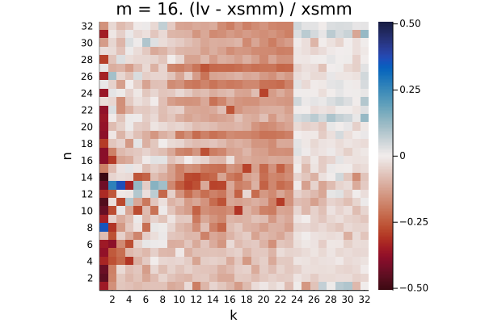
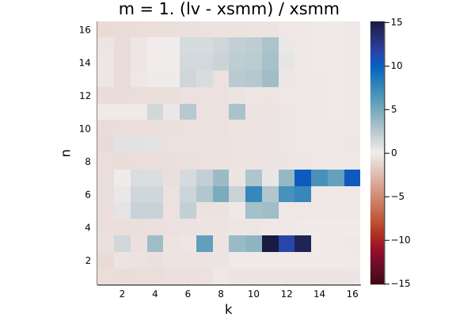
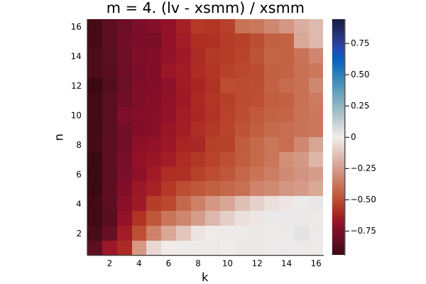
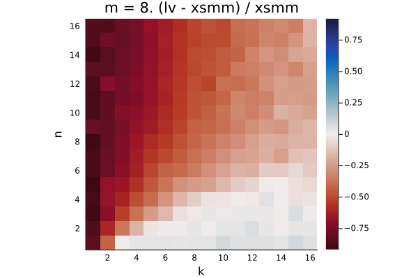

This benchmarks [libxsmm](https://github.com/hfp/libxsmm) vs [LoopVectorization.jl](https://github.com/JuliaSIMD/LoopVectorization.jl) for the batched matmul C = ∑ᵢ Aᵢ* Bᵢ where C is an accumulator of size m×n, all Aᵢ are m×k and all Bᵢ are k×n, and the sum runs over 10k batches. Both libxsmm and LoopVectorization.jl use column-major matrices.

Instructions:

```console
git clone --recursive https://github.com/haampie/smm-bench.git
cd smm-bench
```

## Results

The plots below show the increase in runtime for LoopVectorization relative to libxsmm's runtime; red = better for LV, blue = better for libxsmm.

### zen2 (gcc 9.3)

```
make AVX=2 INTRINSICS=1 STATIC=0 -j
julia --project=. -O3
julia> using Pkg; pkg"instantiate"
julia> ms = (1, 2, 4, 8, 16); ns=1:16; ks=1:16
julia> results = example(ms, ns, ks, 10_000, 20)
julia> do_plot(results, ms, ns, ks)
```


Q₁ = -0.304.  Q₂ = 0.299.  Q₃ = 0.848


Q₁ = -0.504.  Q₂ = -0.179.  Q₃ = 0.955


Q₁ = -0.501.  Q₂ = -0.309.  Q₃ = -0.200


Q₁ = -0.322.  Q₂ = -0.220.  Q₃ = -0.106


Q₁ = -0.066.  Q₂ = 0.021.  Q₃ = 0.196


## broadwell (gcc 10.1, piz daint)

```
make AVX=2 INTRINSICS=1 STATIC=0 CXX=CC CC=cc FC=ftn -j
julia --project=. -O3
julia> using Pkg; pkg"instantiate"
julia> ms = (1, 2, 4, 8, 16); ns=1:16; ks=1:16
julia> results = example(ms, ns, ks, 10_000, 20)
julia> do_plot(results, ms, ns, ks)
```


Q₁ = -0.267.  Q₂ = 0.174.  Q₃ = 0.840


Q₁ = -0.442.  Q₂ = -0.156.  Q₃ = 0.881


Q₁ = -0.412.  Q₂ = -0.250.  Q₃ = -0.161


Q₁ = -0.275.  Q₂ = -0.151.  Q₃ = -0.082


Q₁ = -0.025.  Q₂ = 0.088.  Q₃ = 0.226


## skylake-512 (Gold 6130)
Thanks @chriselrod

```
make AVX=3 -j
julia --project=. -O3
julia> ms = (1, 2, 4, 8, 16); ns=1:16; ks=1:16
julia> results = example(ms, ns, ks, 10_000, 20)
julia> do_plot(results, ms, ns, ks)
```


Q₁ = -0.267.  Q₂ = 0.174.  Q₃ = 0.840


Q₁ = -0.442.  Q₂ = -0.156.  Q₃ = 0.881


Q₁ = -0.412.  Q₂ = -0.250.  Q₃ = -0.161


Q₁ = -0.275.  Q₂ = -0.151.  Q₃ = -0.082



Q₁ = -0.025.  Q₂ = 0.088.  Q₃ = 0.226
## cascadelake (10980xe)
Thanks @chriselrod

```
make AVX=3 -j
julia --project=. -O3
julia> ms = (1, 2, 4, 8, 16); ns=1:16; ks=1:16
julia> results = example(ms, ns, ks, 10_000, 20)
julia> do_plot(results, ms, ns, ks)
```


Q₁ = -0.580.  Q₂ = -0.320.  Q₃ = 0.154


Q₁ = -0.709.  Q₂ = -0.504.  Q₃ = -0.350



Q₁ = -0.701.  Q₂ = -0.533.  Q₃ = -0.346



Q₁ = -0.620.  Q₂ = -0.377.  Q₃ = -0.177


Q₁ = -0.709.  Q₂ = -0.513.  Q₃ = -0.330
