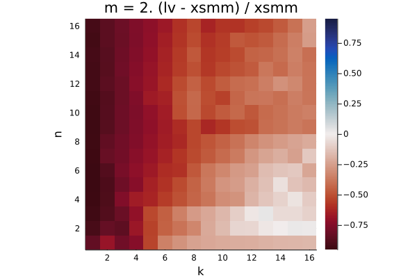
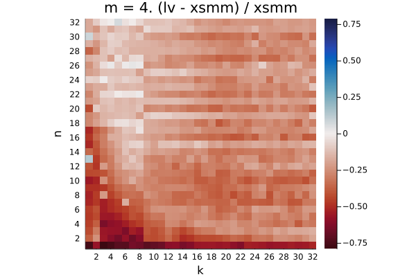

This benchmarks [libxsmm](https://github.com/hfp/libxsmm) vs [LoopVectorization.jl](https://github.com/JuliaSIMD/LoopVectorization.jl) for the batched matmul C = ∑ᵢ Aᵢ* Bᵢ where C is an accumulator of size m×n, all Aᵢ are m×k and all Bᵢ are k×n, and the sum runs over 10k batches. Both libxsmm and LoopVectorization.jl use column-major matrices.

Instructions:

```console
git clone --recursive https://github.com/haampie/smm-bench.git
cd smm-bench
```

## Results

The plots below show the increase in runtime for LoopVectorization relative to libxsmm's runtime; red = better for LV, blue = better for libxsmm.

<!-- results -->
## broadwell


Q₁ = -0.202.  Q₂ = 0.127.  Q₃ = 0.897


Q₁ = -0.236.  Q₂ = -0.136.  Q₃ = -0.037


Q₁ = -0.136.  Q₂ = -0.072.  Q₃ = -0.013


Q₁ = 0.086.  Q₂ = 0.137.  Q₃ = 0.209


## cascadelake


Q₁ = -0.580.  Q₂ = -0.320.  Q₃ = 0.154



Q₁ = -0.709.  Q₂ = -0.504.  Q₃ = -0.350


Q₁ = -0.701.  Q₂ = -0.533.  Q₃ = -0.346


Q₁ = -0.620.  Q₂ = -0.377.  Q₃ = -0.177


Q₁ = -0.709.  Q₂ = -0.513.  Q₃ = -0.330


## haswell


Q₁ = -0.159.  Q₂ = 0.178.  Q₃ = 0.792


Q₁ = -0.213.  Q₂ = -0.090.  Q₃ = 0.032


Q₁ = -0.097.  Q₂ = -0.033.  Q₃ = 0.009


Q₁ = 0.090.  Q₂ = 0.150.  Q₃ = 0.222


## znver2


Q₁ = -0.136.  Q₂ = 0.345.  Q₃ = 0.908



Q₁ = -0.259.  Q₂ = -0.070.  Q₃ = 0.006


Q₁ = -0.163.  Q₂ = -0.089.  Q₃ = -0.047


Q₁ = -0.004.  Q₂ = 0.061.  Q₃ = 0.162
